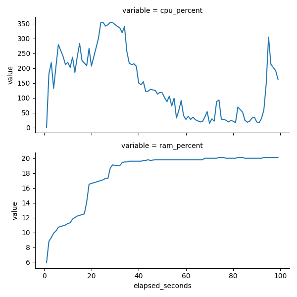

# Overview
## `tu`
Monitors ***t***ask ***u***sage (CPU, GPU & RAM) and saves the time series data to a CSV file.

Originally created to see if containers were over-allocated resource in serverless infrastructure.

## `bu`
An S3 ***b***ucket ***u***tility to make handling object versions simpler.

Created after a surprise when a bucket, supposedly containing 100 MiB of objects, was found to be 10 GiB due to 'object churn' and versioning.  The AWS S3 CLI [doesn't make it easy]([url](https://serverfault.com/questions/84815/how-can-i-get-the-size-of-an-amazon-s3-bucket)) to see total size including object versions.

# Installation

1. [Install Rust](https://rustup.rs/)
1. Close and reopen your terminal to update your path.
1. To download, compile and locally install (to `/home/[username]/.cargo/bin/`) use `cargo install`.  For example, to install `bu`:
```
cargo install --git https://github.com/tearne/tools --locked --bin bu
```

# `bu` examples
It assumes an IAM Role is provided via instance profile - you can't configure credentials manually at present.

Report the size of a single bucket/prefix to stdout:
```
bu size my-bucket/somePrefix
```
Output:
> s3://my-bucket/somePrefix:  
9.6 GiB (current obj. 1.1 GiB, current vers. 0 B, orphaned vers. 8.5 GiB)

Report the size of several buckets/prefixes to a CSV file (defaults to `bucket_usage.csv`):
```
bu size-report my-bucket/somePrefix,your-bucket,another-bucket
```

Delete all versions of an object under bucket/prefix
```
bu destroy my-bucket/somePrefix
```

# `tu` examples
```
tu -- start_my_minecraft_server.sh
```
It will generate a CSV file: `task_usage.csv`.

|timestamp|elapsed_seconds|cpu_percent|ram_percent|ram_mb|gpu_percent
|-|-|-|-|-|-|
|2025-05-12 20:06:27|1|0.0|9|470.5|NA|
|2025-05-12 20:06:28|2|180.7|8.8|700.5|NA|
|2025-05-12 20:06:29|3|218.7|9.3|735.0|NA|
|2025-05-12 20:06:30|4|132.1|9.9|789.5|NA|
|...|...|...|...|...|...|

The [example Python code](./python/tu/plot.py) shows how to plot this with Polars and Seaborn.  The simplest way to run it is to instal `uv` (fast Python package manager) and then run the script as an executable `python/tu/plot.py`.



## GPU utilisation
```sh
tu -- --nvml -vvv -- gpu-burn 6
```
It will generate a CSV file: `task_usage.csv`.
|timestamp|elapsed_seconds|cpu_percent|ram_percent|ram_mb|gpu_percent
|-|-|-|-|-|-|
|2025-09-15 13:33:05|1|2.6|1.5|232.3|0|
|2025-09-15 13:33:06|2|2.9|3.9|620.8|0|
|2025-09-15 13:33:07|3|0.0|9.0|1415.6|23|
|2025-09-15 13:33:08|4|0.0|9.0|1415.6|97|
|2025-09-15 13:33:09|5|0.0|9.0|1415.6|100|
|...|...|...|...|...|...|

